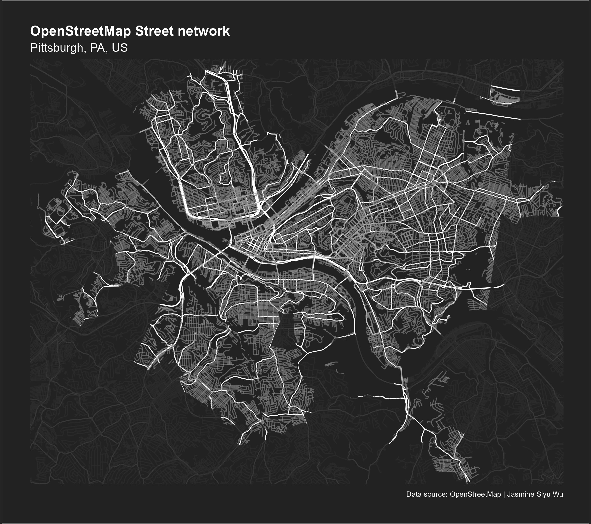

You will be participating in the 30-day mapping challenge! For this class, you will
be required to submit a map for at least 10 of the days above. Your map should be 
posted to your GitHub Repo on the corresponding day and if you have an account, 
post on social media with the hashtag #30DayMapChallenge and tag the MUSA program also of course!


If you just post 10 maps on the last day, I won't be happy. Feel free to plan ahead. 
The map doesn't have to be perfect but try to use our data visualization design 
principles. You can use any mapping package. 


Please organize your repo so that it also includes a Folder for the outputs and 
save each map as a file (png or jpeg). Document your R markdown. Make that pretty - also.

| Day | Theme | Details |
|-----|-------|---------|
| **1** | **Points** | A map with points |
| 2 | Lines | A map with lines |
| **3** | **Polygons** | A map with polygons |
| **4** | **A bad map** | Let's get this over with |
| 5 | Analog Map | Non-digital maps |
| **6** | **Asia** | Largest of the continents |
| 7 | Navigation | A map that helps you to navigate |
| 8 | Africa | Second-largest and second-most populous continent |
| **9** | **Hexagons** | 6 sides, 6 angles, and 6 vertices |
| 10 | North America | Northern part of the American continent |
| 11 | Retro | A blast from the past |
| 12 | South America | Southern part of the American continent |
| 13 | Choropleth | Classic thematic map: a choropleth |
| 14 | Europe | The westernmost peninsulas of Eurasia |
| **15** | **OpenStreetMap** | The greatest of the datasets. Remember to give credit. |
| 16 | Oceania | Region made up of thousands of islands throughout the Central and South Pacific |
| **17** | **Flow** | Flow of transport, people |
| 18 | Atmosphere | Conditions of the atmosphere can be either weather or climate |
| 19 | 5-minute map | Spend no more than 5 minutes to prepare this map |
| 20 | Outdoors | Map of mountains, trails, or something completely different |
| 21 | Raster | Pixels, please |
| 22 | North is not always up | ⬆️ |
| 23 | 3D | The third dimension |
| 24 | Black & white | Only two colors allowed |
| 25 | Antarctica | A cold continent that can't be reached with Web Mercator |
| **26** | **Minimal** | Less is more |
| **27** | **Dot** | Dot density, a single dot in space or something different |
| 28 | Is this a chart or a map? | In thematic maps, you can't always tell. Try to stretch the limits |
| **29** | **Population** | A classic theme for a map |
| 30 | "My favorite.." | You choose! |


```{r libraries, include=TRUE, cache = FALSE, message = FALSE, warning = FALSE, results=FALSE}

knitr::opts_chunk$set(echo = TRUE)

#Loading Libraries
library(tidyverse)
library(knitr)
library(ggplot2)
library(ggmap)
library(grid)
library(gridExtra)
library(kableExtra)
library(dplyr)
library(ggtext)
library(grid)
library(gridExtra)
library(gridtext)
library(giscoR)
library(sf)
library(tidycensus)
library(scales)

options(scipen=1)  #999

```


```{r set up theme, include=TRUE, cache = FALSE, message = FALSE, results=FALSE}


map_theme <- function(base_size = 12) {
  theme(plot.title =element_text(size=12),
                  plot.subtitle = element_text(size=8),
                  plot.caption = element_text(size = 6),
                  plot.background = element_rect(fill = "#222222"),
                  #plot.background = element_blank(),
                  axis.line=element_blank(),
                  axis.text.x=element_blank(),
                  axis.text.y=element_blank(),
                  axis.ticks=element_blank(),
                  axis.title.x=element_blank(),
                  axis.title.y=element_blank(),
                  panel.background = element_rect(fill = "#222222"),
                  #panel.background = element_blank(),
                  panel.border=element_blank(),
                  panel.grid.major=element_line(colour = 'transparent'),
                  panel.grid.minor=element_blank(),
                  legend.direction = "vertical", 
                  legend.position = "right",
                  legend.background = element_rect(fill = "#222222"),
                  plot.margin = margin(1, 1, 1, 1, 'cm'),
                  legend.key.height = unit(1, "cm"), legend.key.width = unit(0.2, "cm")
  )}
```

## Day 1: Points map - [Top USA international airports]

Data sources: 

[All the Airports Across The World Dataset](https://www.kaggle.com/datasets/timmofeyy/all-the-airport-across-the-world-dataset?select=airports_data.csv)

1. **IATA** stands for the International Air Transport Association. It is a global trade association representing airlines and the air transport industry. IATA's main objective is to promote safe, reliable, and efficient air transportation. It establishes industry standards, provides training and support services, and advocates for the interests of its member airlines. IATA also develops and maintains industry codes, such as airline and airport codes, to ensure uniformity and efficiency in air travel operations worldwide.

2. **ICAO** stands for the International Civil Aviation Organization. It is a specialized agency of the United Nations responsible for setting international standards and regulations in the field of civil aviation. ICAO's primary goal is to promote the safe, secure, and orderly development of international civil aviation. It establishes standards and procedures for aviation safety, security, efficiency, and environmental protection. ICAO also facilitates cooperation among member states and provides technical assistance and training to help improve aviation capabilities worldwide. Additionally, it serves as a forum for member states to address common aviation issues and work towards harmonization of regulations and practices.

3. **Altitude** refers to the vertical distance above a reference point or a specific surface, such as sea level. It is commonly used in aviation and geography to indicate the height or elevation of an object or location above the Earth's surface. Altitude is measured in units such as feet or meters. In aviation, altitude plays a crucial role in determining the aircraft's position in relation to the ground or other aircraft, as well as in planning flight routes and complying with airspace regulations. In geography, altitude is used to describe the height of mountains, hills, or other landforms, and it affects factors like climate, vegetation, and atmospheric conditions.


```{r read data, include=TRUE, cache = FALSE, message = FALSE, warning = FALSE, results=FALSE}

airports <- read.csv("./../MUSA695_A4_Data/archive/airports_data.csv") %>% 
              st_as_sf(., coords=c("lon", "lat"), crs=4326)
airports <- airports %>% 
  mutate(long = st_coordinates(airports)[, 1],
         lat = st_coordinates(airports)[, 2])
airports_metro <- read.csv("./../MUSA695_A4_Data/archive/metro_in_airports_iata_codes.csv")

airlines_meal <- read.csv("./../MUSA695_A4_Data/archive/airlines_meal_codes.csv")
entertainment_iata <- read.csv("./../MUSA695_A4_Data/archive/entertainment_iata_codes.csv")
aircrafts_iata <- read.csv("./../MUSA695_A4_Data/archive/aircrafts_iata_codes.csv")
airlines_country <- read.csv("./../MUSA695_A4_Data/archive/airlines_and_countries_they_operate_in.csv")

airports_global_entry <- read.csv("./../MUSA695_A4_Data/airports_global_entry.csv") %>% 
                            merge(airports, .,
                                  by.y="iata", by.x="iata", all.y=TRUE)
usa_top_intl_airports <- read.csv("./../MUSA695_A4_Data/usa_top_itl_airports.csv") %>% 
                            merge( airports, .,
                                  by.y="iata.code", by.x="iata", all.y=TRUE) %>%
                          mutate(intl_flights = as.numeric(intl_flights))

asia_busiest_airports <- read.csv("./../MUSA695_A4_Data/asia_busiest_airports.csv") %>% 
                            merge(airports, .,
                                  by.y="iata", by.x="iata", all.y=TRUE) %>%
                          mutate(weekly_flights = as.numeric(weekly_flights))

# read world geographies
countries <-  gisco_get_countries(resolution = "03", 
                                  epsg = "4326")  
asia <- gisco_get_countries(resolution = "03", 
                            epsg = "4326",
                            region = 'Asia')  

us <- get_decennial(geography = "state", 
                    year = 2010,
                    variables = "P001001",
                    geometry = TRUE)

us <- st_transform(us, crs = 'EPSG:5070')
cont_us <- us%>% filter(NAME != 'Alaska' & NAME != 'Hawaii')

```

[USA top international airports Dec 2022](https://simpleflying.com/usa-top-international-airports-december-2022/#:~:text=Of%20major%20airports%2C%20Miami%20leapfrogs,7.4%25)%2C%20and%20many%20more)

```{r point map, include=TRUE, cache = FALSE, message = FALSE, warning = FALSE, fig.height=6, fig.width=9}
plot_data <- usa_top_intl_airports %>% 
  st_transform(., crs='EPSG:5070')
plot_data <- plot_data %>%  
  mutate(long_new = st_coordinates(plot_data)[, 1],
         lat_new = st_coordinates(plot_data)[, 2])


ggplot() +
  geom_sf(data = cont_us,
          fill = "#ffffff", color="#333333", linewidth = 0.1) +
  geom_sf(data = plot_data,
          aes(size=intl_flights), alpha=0.7,
          col = "#EC7E00") +
  scale_size(breaks = waiver(), range=c(2, 7),
             name="Total international flights",
             guide=guide_legend(direction="horizontal")) +
  geom_richtext(aes(x = plot_data[plot_data$iata=="JFK",]$long_new,
                    y = plot_data[plot_data$iata=="JFK",]$lat_new,
                label = "JFK (38% int. flights)"),
                size = 3.5, position = "identity", fontface="bold",                
                fill = NA, label.color = NA, color="#EC7E00",
                hjust=-0.1, vjust=0.1) +
  geom_richtext(aes(x = plot_data[plot_data$iata=="EWR",]$long_new,
                    y = plot_data[plot_data$iata=="EWR",]$lat_new,
                label = "EWR (24% int. flights)"),
                size = 3.5, position = "identity", fontface="bold",                
                fill = NA, label.color = NA, color="#EC7E00",
                hjust=-0.1, vjust=0.7) +
  geom_richtext(aes(x = plot_data[plot_data$iata=="SFO",]$long_new,
                    y = plot_data[plot_data$iata=="SFO",]$lat_new,
                label = "SFO (19% int. flights)"),
                size = 3.5, position = "identity", fontface="bold",                
                fill = NA, label.color = NA, color="#EC7E00",
                hjust=0, vjust=0.2) +
  geom_richtext(aes(x = plot_data[plot_data$iata=="LAX",]$long_new,
                    y = plot_data[plot_data$iata=="LAX",]$lat_new,
                label = "LAX (21% int. flights)"),
                size = 3.5, position = "identity", fontface="bold",                
                fill = NA, label.color = NA, color="#EC7E00",
                hjust=-0.05, vjust=0.3) +
  geom_richtext(aes(x = plot_data[plot_data$iata=="MIA",]$long_new,
                    y = plot_data[plot_data$iata=="MIA",]$lat_new,
                label = "MIA (43% int. flights)"),
                size = 3.5, position = "identity", fontface="bold",                
                fill = NA, label.color = NA, color="#EC7E00",
               hjust=-0.1, vjust=1.1) +
  geom_richtext(aes(x = plot_data[plot_data$iata=="FLL",]$long_new,
                    y = plot_data[plot_data$iata=="FLL",]$lat_new,
                label = "FLL (25% int. flights)"),
                size = 3.5, position = "identity", fontface="bold",                
                fill = NA, label.color = NA, color="#EC7E00",
                hjust=-0.1, vjust=0.4) +
  geom_richtext(aes(x = plot_data[plot_data$iata=="IAH",]$long_new,
                    y = plot_data[plot_data$iata=="IAH",]$lat_new,
                label = "IAH (21% int. flights)"),
                size = 3.5, position = "identity", fontface="bold",                
                fill = NA, label.color = NA, color="#EC7E00",
                hjust=-0.05, vjust=1.2) +
  geom_richtext(aes(x = plot_data[plot_data$iata=="DFW",]$long_new,
                    y = plot_data[plot_data$iata=="DFW",]$lat_new,
                label = "DFW (12% int. flights)"),
                size = 3.5, position = "identity", fontface="bold",                
                fill = NA, label.color = NA, color="#EC7E00",
                hjust=-0.05, vjust=0.4) +
  geom_richtext(aes(x = plot_data[plot_data$iata=="ATL",]$long_new,
                    y = plot_data[plot_data$iata=="ATL",]$lat_new,
                label = "ATL (9% int. flights)"),
                size = 3.5, position = "identity", fontface="bold",                
                fill = NA, label.color = NA, color="#EC7E00",
                hjust=-0.05, vjust=0.4) +
  geom_richtext(aes(x = plot_data[plot_data$iata=="ORD",]$long_new,
                    y = plot_data[plot_data$iata=="ORD",]$lat_new,
                label = "ORD (11% int. flights)"),
                size = 3.5, position = "identity", fontface="bold",                
                fill = NA, label.color = NA, color="#EC7E00",
                hjust=0.15, vjust=1) +
  # geom_richtext(aes(x = usa_top_intl_airports[usa_top_intl_airports$iata=="MIA",]$long, 
  #                    y = usa_top_intl_airports[usa_top_intl_airports$iata=="MIA",]$lat,
  #                    label = "Miami International Airport \nInternaional flights: 43.10%"), size = 3,
  #                    fill = NA, label.color = NA, color="#FB8500") +
  labs(title = "<span style='color:#ffffff'>Top 10</span> <span style='color:#EC7E00'>international airports</span> <span style='color:#ffffff'>are responsible for 62% of the U.S. international operations</span>", 
       subtitle = "Dec. 2022",
       caption = "Data source: Cirium | Jasmine Siyu Wu\nNote: Data were retrieved from Simple Flying") +
  map_theme()+
  theme(plot.title = element_markdown(size = 13, face = "bold"),
        plot.subtitle = element_text(size=10, color = "#ffffff"),
        plot.caption = element_text(size = 6, color = "#ffffff"),
        legend.title = element_text(size = 9, color = "#ffffff"),
        legend.text = element_text(size = 8, color = "#ffffff"),
        legend.position = c(0.3, 0.05),
        legend.key = element_rect(fill = "transparent") )

# New York JFL #1 of total international flights and #3 of proportion of international flights
# Miami #2 of total flights and #2 of proportion of international flights
# Los Angeles #3 of total international flights and #10 of proportion of international flights

# ggsave("day1.jpeg", device = "jpeg", width = 9, height=6,
#        path = "Output")


ggplot() +
  geom_sf(data = cont_us,
          fill = "#ffffff", color="#333333", linewidth = 0.1) +
  geom_sf(data = plot_data, size=2,
          col = "#EC7E00") +
  geom_richtext(aes(x = plot_data[plot_data$iata=="JFK",]$long_new,
                    y = plot_data[plot_data$iata=="JFK",]$lat_new,
                label = "JFK (38% int. flights)"),
                size = 3.5, position = "identity", fontface="bold",                
                fill = NA, label.color = NA, color="#EC7E00",
                hjust=-0.1, vjust=0.1) +
  geom_richtext(aes(x = plot_data[plot_data$iata=="EWR",]$long_new,
                    y = plot_data[plot_data$iata=="EWR",]$lat_new,
                label = "EWR (24% int. flights)"),
                size = 3.5, position = "identity", fontface="bold",                
                fill = NA, label.color = NA, color="#EC7E00",
                hjust=-0.1, vjust=0.7) +
  geom_richtext(aes(x = plot_data[plot_data$iata=="SFO",]$long_new,
                    y = plot_data[plot_data$iata=="SFO",]$lat_new,
                label = "SFO (19% int. flights)"),
                size = 3.5, position = "identity", fontface="bold",                
                fill = NA, label.color = NA, color="#EC7E00",
                hjust=0, vjust=0.2) +
  geom_richtext(aes(x = plot_data[plot_data$iata=="LAX",]$long_new,
                    y = plot_data[plot_data$iata=="LAX",]$lat_new,
                label = "LAX (21% int. flights)"),
                size = 3.5, position = "identity", fontface="bold",                
                fill = NA, label.color = NA, color="#EC7E00",
                hjust=-0.05, vjust=0.3) +
  geom_richtext(aes(x = plot_data[plot_data$iata=="MIA",]$long_new,
                    y = plot_data[plot_data$iata=="MIA",]$lat_new,
                label = "MIA (43% int. flights)"),
                size = 3.5, position = "identity", fontface="bold",                
                fill = NA, label.color = NA, color="#EC7E00",
               hjust=-0.1, vjust=1.1) +
  geom_richtext(aes(x = plot_data[plot_data$iata=="FLL",]$long_new,
                    y = plot_data[plot_data$iata=="FLL",]$lat_new,
                label = "FLL (25% int. flights)"),
                size = 3.5, position = "identity", fontface="bold",                
                fill = NA, label.color = NA, color="#EC7E00",
                hjust=-0.1, vjust=0.4) +
  geom_richtext(aes(x = plot_data[plot_data$iata=="IAH",]$long_new,
                    y = plot_data[plot_data$iata=="IAH",]$lat_new,
                label = "IAH (21% int. flights)"),
                size = 3.5, position = "identity", fontface="bold",                
                fill = NA, label.color = NA, color="#EC7E00",
                hjust=-0.05, vjust=1.2) +
  geom_richtext(aes(x = plot_data[plot_data$iata=="DFW",]$long_new,
                    y = plot_data[plot_data$iata=="DFW",]$lat_new,
                label = "DFW (12% int. flights)"),
                size = 3.5, position = "identity", fontface="bold",                
                fill = NA, label.color = NA, color="#EC7E00",
                hjust=-0.05, vjust=0.4) +
  geom_richtext(aes(x = plot_data[plot_data$iata=="ATL",]$long_new,
                    y = plot_data[plot_data$iata=="ATL",]$lat_new,
                label = "ATL (9% int. flights)"),
                size = 3.5, position = "identity", fontface="bold",                
                fill = NA, label.color = NA, color="#EC7E00",
                hjust=-0.05, vjust=0.4) +
  geom_richtext(aes(x = plot_data[plot_data$iata=="ORD",]$long_new,
                    y = plot_data[plot_data$iata=="ORD",]$lat_new,
                label = "ORD (11% int. flights)"),
                size = 3.5, position = "identity", fontface="bold",                
                fill = NA, label.color = NA, color="#EC7E00",
                hjust=0.15, vjust=1) +
  # geom_richtext(aes(x = usa_top_intl_airports[usa_top_intl_airports$iata=="MIA",]$long, 
  #                    y = usa_top_intl_airports[usa_top_intl_airports$iata=="MIA",]$lat,
  #                    label = "Miami International Airport \nInternaional flights: 43.10%"), size = 3,
  #                    fill = NA, label.color = NA, color="#FB8500") +
  labs(title = "<span style='color:#ffffff'>Top 10</span> <span style='color:#EC7E00'>international airports</span> <span style='color:#ffffff'>are responsible for 62% of the U.S. international operations</span>", 
       subtitle = "Dec. 2022",
       caption = "Data source: Cirium | Jasmine Siyu Wu\nNote: Data were retrieved from Simple Flying") +
  map_theme()+
  theme(plot.title = element_markdown(size = 13, face = "bold"),
        plot.subtitle = element_text(size=10, color = "#ffffff"),
        plot.caption = element_text(size = 6, color = "#ffffff"),
        legend.title = element_text(size = 9, color = "#ffffff"),
        legend.text = element_text(size = 8, color = "#ffffff"),
        legend.position = c(0.3, 0.05),
        legend.key = element_rect(fill = "transparent") )

# ggsave("day1_v2.jpeg", device = "jpeg", width = 9, height=6,
#        path = "Output")

```


## Day 3: Polygons map [AA, United, and Delta internatioal flight destinations]

This map still uses [All the Airports Across The World Dataset](https://www.kaggle.com/datasets/timmofeyy/all-the-airport-across-the-world-dataset?select=airports_data.csv), specifically its *airlines_country.csv*.

```{r polygon map, include=TRUE, cache = FALSE, message = FALSE, warning = FALSE, fig.height=6, fig.width=10}

#airlines_country %>% filter(IATACode %in% c("AA", "UA", "DL", "AS"))

AA_countries <- airlines_country[airlines_country$IATACode == "AA", ]$Countries
AA_countries <- gsub('[^[:alnum:] ]', '', AA_countries)
AA_countries <- as.list(strsplit(AA_countries, " "))[[1]]


UA_countries <- airlines_country[airlines_country$IATACode == "UA", ]$Countries
UA_countries <- gsub('[^[:alnum:] ]', '', UA_countries)
UA_countries <- as.list(strsplit(UA_countries, " "))[[1]]

DL_countries <- airlines_country[airlines_country$IATACode == "DL", ]$Countries
DL_countries <- gsub('[^[:alnum:] ]', '', DL_countries)
DL_countries <- as.list(strsplit(DL_countries, " "))[[1]]

AS_countries <- airlines_country[airlines_country$IATACode == "AS", ]$Countries
AS_countries <- gsub('[^[:alnum:] ]', '', AS_countries)
AS_countries <- as.list(strsplit(AS_countries, " "))[[1]]

countries <- countries %>% 
  mutate(AA = if_else(CNTR_ID %in% AA_countries, 1, 0),
         UA = if_else(CNTR_ID %in% UA_countries, 1, 0),
         DL = if_else(CNTR_ID %in% DL_countries, 1, 0),
         AS = if_else(CNTR_ID %in% AS_countries, 1, 0))

# sum(countries$AA)
# sum(countries$AS)
# sum(countries$DL)
# sum(countries$UA)


# # countries that all three airlines can get you to from the U.S.    45
# countries_centroids %>% subset(AA == 1 & UA == 1 & DL == 1)
# # countries that only UA can get you to from the U.S.   11
# countries_centroids %>% subset(AA == 0 & UA == 1 & DL == 0)
# # countries that only AA can get you to from the U.S.   9
# countries_centroids %>% subset(AA == 1 & UA == 0 & DL == 0)
# # countries that only DL can get you to from the U.S.   3
# countries_centroids %>% subset(AA == 0 & UA == 0 & DL == 1)
# # countries that only UA and AA can get you to from the U.S.    4
# countries_centroids %>% subset(AA == 1 & UA == 1 & DL == 0)
# # countries that only UA and DL can get you to from the U.S.    7
# countries_centroids %>% subset(AA == 0 & UA == 1 & DL == 1)


# the countries that only AA or UA or Delta can get you to
plot_data <- countries %>% merge(., countries %>% st_transform(st_crs(airports)) %>%
                                   mutate(centroids = st_centroid(st_geometry(.))) %>%
                                   mutate(lon = unlist(map(.$centroids,1)),
                                         lat = unlist(map(.$centroids,2))) %>%
                                   select(CNTR_ID, lat, lon) %>%
                                   st_drop_geometry(),
                                 by.x="CNTR_ID", by.y="CNTR_ID") %>%
  mutate(only_serv = case_when(AA==1 & UA==0 & DL==0 ~ "American Airlines only",
                               AA==0 & UA==1 & DL==0 ~ "United Airlines only",
                               AA==0 & UA==0 & DL==1 ~ "Delta only",
                               AA==1 & UA==1 & DL==1 ~ "All fly",
                               AA==1 & UA==1 & DL==0 ~ "American Airlines or United",
                               AA==0 & UA==1 & DL==1 ~ "United or Delta"),
         only_serv = if_else(is.na(only_serv), "None flies", only_serv)) %>% 
  filter(only_serv != "None flies") %>%
  st_transform(st_crs(airports))


ggplot()+
  geom_sf(data = countries %>% st_transform(st_crs(airports)), 
          fill = "#444444", color="#222222", linewidth=0.2) +
  geom_sf(data=plot_data, 
          aes(fill = only_serv), color="#222222", linewidth=0.2)+
  scale_fill_manual(values = c("#aaaaaa", "#B41830", "#AE6570",  "#6C84AA", "#2d5daa", "#083378"), 
                    name = "",
                    guide=guide_legend(
                                      keywidth=1, keyheight  = 1,
                                      frame.colour="transparent",
                                      frame.linewidth=0.5, ticks.colour="#222222", 
                                      title="Airline to destication country")
                    ) +
  # geom_text(data=plot_data %>% filter(only_serv %in% c("AA only", "UA only", "DL only")), 
  #           aes(x=lon, y=lat, label = NAME_ENGL), 
  #           position="identity", vjust=0.2, hjust=-0.2,
  #           check_overlap = TRUE,
  #           size = 3, color="#FFFFFF") +
  #scale_alpha_continuous(range = c(0.03, 0.3))+
  labs(title = "Explore Your World: Mapping American Airlines, Delta, & United Flight Destinations from the US", 
       caption = "Data source: EFIMPOLIANSKII @Kaggle | Jasmine Siyu Wu"
       ) +
  map_theme() +
  theme(plot.title = element_text(size = 14, face = "bold", color = "#ffffff"),
        plot.subtitle = element_text(size=15),
        plot.caption = element_text(size = 6, color = "#ffffff"),
        legend.title = element_text(size = 10, color = "#ffffff"),
        legend.text = element_text(size = 9, color = "#ffffff"),
        legend.position = c(0.1, 0.35),
        legend.background = element_rect(fill="#222222"))

# ggsave("day3.jpeg", device = "jpeg", width = 10, height=6,
#        path = "Output")

```

## Day 4: Bad map [Global entry to United States]

Data were retrieved from [Airports with Global Entry](https://www.cbp.gov/travel/trusted-traveler-programs/global-entry/airports-with-global-entry)

```{r black white map, include=TRUE, cache = FALSE, message = FALSE, warning = FALSE, fig.height=5, fig.width=9}


ggplot() +
  geom_sf(data = countries %>% filter(NAME_ENGL != "United States"),
          fill = "#aaaaaa", color="#222222", linewidth = 0.1, alpha=0.8) +
    geom_sf(data = countries %>% filter(NAME_ENGL == "United States"),
          fill = "#ffffff", color="#222222", linewidth = 0.1, alpha=0.8) +
  geom_sf(data = airports_global_entry, size=1,
          col = "#EC7E00") +
  # geom_richtext(aes(x = plot_data[plot_data$iata=="JFK",]$long_new,
  #                   y = plot_data[plot_data$iata=="JFK",]$lat_new,
  #               label = "JFK (38% int. flights)"),
  #               size = 3.5, position = "identity", fontface="bold",                
  #               fill = NA, label.color = NA, color="#EC7E00",
  #               hjust=-0.1, vjust=0.1) +
  # geom_richtext(aes(x = usa_top_intl_airports[usa_top_intl_airports$iata=="MIA",]$long, 
  #                    y = usa_top_intl_airports[usa_top_intl_airports$iata=="MIA",]$lat,
  #                    label = "Miami International Airport \nInternaional flights: 43.10%"), size = 3,
  #                    fill = NA, label.color = NA, color="#FB8500") +
  labs(title = "Bad map: Global entry airports to the United States", 
       caption = "Data source: U.S. Customs and Border Protection | Jasmine Siyu Wu") +
  map_theme()+
  theme(plot.title = element_markdown(size = 13, face = "bold", colour = "#ffffff"),
        plot.subtitle = element_text(size=10, color = "#ffffff"),
        plot.caption = element_text(size = 6, color = "#ffffff"),
        legend.title = element_text(size = 9, color = "#ffffff"),
        legend.text = element_text(size = 8, color = "#ffffff"),
        legend.position = c(0.3, 0.05),
        legend.key = element_rect(fill = "transparent") )

# ggsave("day4.jpeg", device = "jpeg", width = 9, height=5,
#        path = "Output")
```

## Day 6: Asia [Busiest airports in Asia]

This map uses the data retrived from [Busiest airports in Asia, weekly August 2023 flights](https://simpleflying.com/asia-busiest-airports-august-2023/). Opened in 2021, Chengdu Tianfu International Airport became the 8th busiest airport in Asia in August 2023.


```{r asia map, include=TRUE, cache = FALSE, message = FALSE, warning = FALSE, fig.height=6, fig.width=9}

plot_data <- asia_busiest_airports
plot_data <- plot_data %>%
  mutate(long_new = st_coordinates(plot_data)[, 1],
         lat_new = st_coordinates(plot_data)[, 2])


ggplot() +
  geom_sf(data = asia,
          fill = "#aaaaaa", color="#222222", linewidth = 0.1) +
  geom_sf(data = plot_data, 
          aes(size=weekly_flights), alpha=0.6,
          col = "#EC7E00") +
  geom_sf(data = plot_data, size=0.4,
          col = "#EC7E00") +
  scale_size(breaks = waiver(), range=c(2, 10),
             name="Total weekly passenger flights \n(August 2023)",
             guide=guide_legend(direction="horizontal")) +
  # geom_text(data=plot_data %>% filter(airport != "Chengdu Tianfu"),
  #           aes(x=long_new, y=lat_new, label = airport),
  #           position="identity", vjust=0.2, hjust=-0.7,
  #           size = 3, color="#222222") +
  geom_richtext(aes(x = plot_data[plot_data$iata=="CAN",]$long_new,
                    y = plot_data[plot_data$iata=="CAN",]$lat_new,
                label = "#1 Guangzhou"),
                size = 3, position = "identity", fontface="bold",                
                fill = NA, label.color = NA, color="#ffffff",
                hjust=0.3, vjust=1.2) +
  geom_richtext(aes(x = plot_data[plot_data$iata=="HND",]$long_new,
                  y = plot_data[plot_data$iata=="HND",]$lat_new,
                label = "#2 Tokyo Haneda"),
                size = 3, position = "identity", fontface="bold",                
                fill = NA, label.color = NA, color="#ffffff",
                hjust=0.3, vjust=1.3) +
  geom_richtext(aes(x = plot_data[plot_data$iata=="PVG",]$long_new,
                  y = plot_data[plot_data$iata=="PVG",]$lat_new,
                label = "#3 Shanghai Pudong"),
                size = 3, position = "identity", fontface="bold",                
                fill = NA, label.color = NA, color="#ffffff",
                hjust=0.3, vjust=1.3) +
  geom_richtext(aes(x = plot_data[plot_data$iata=="DEL",]$long_new,
                  y = plot_data[plot_data$iata=="DEL",]$lat_new,
                label = "#4 Delhi"),
                size = 3, position = "identity", fontface="bold",                
                fill = NA, label.color = NA, color="#222222",
                hjust=0.3, vjust=1.3) +
  geom_richtext(aes(x = plot_data[plot_data$iata=="PEK",]$long_new,
                  y = plot_data[plot_data$iata=="PEK",]$lat_new,
                label = "#5 Beijing Capital"),
                size = 3, position = "identity", fontface="bold",                
                fill = NA, label.color = NA, color="#222222",
                hjust=0.3, vjust=-0.3) +
  geom_richtext(aes(x = plot_data[plot_data$iata=="SZX",]$long_new,
                  y = plot_data[plot_data$iata=="SZX",]$lat_new,
                label = "#6 Shenzhen Bao'an"),
                size = 3, position = "identity", fontface="bold",                
                fill = NA, label.color = NA, color="#ffffff",
                hjust=0.1, vjust=1.4) +
    geom_richtext(aes(x = plot_data[plot_data$iata=="CGK",]$long_new,
                  y = plot_data[plot_data$iata=="CGK",]$lat_new,
                label = "#7 Jakarta"),
                size = 3, position = "identity", fontface="bold",                
                fill = NA, label.color = NA, color="#ffffff",
                hjust=0.3, vjust=1.4) +
    geom_richtext(aes(x = plot_data[plot_data$iata=="TFU",]$long_new,
                  y = plot_data[plot_data$iata=="TFU",]$lat_new,
                label = "#8 Chengdu Tianfu"),
                size = 3, position = "identity", fontface="bold",                
                fill = NA, label.color = NA, color="#222222",
                hjust=0.3, vjust=-0.05) +
    geom_richtext(aes(x = plot_data[plot_data$iata=="XIY",]$long_new,
                    y = plot_data[plot_data$iata=="XIY",]$lat_new,
                  label = "#9 Xi'an Xianyang"),
                  size = 3, position = "identity", fontface="bold",                
                  fill = NA, label.color = NA, color="#222222",
                  hjust=0.5, vjust=-0.1) +
    geom_richtext(aes(x = plot_data[plot_data$iata=="KMG",]$long_new,
                  y = plot_data[plot_data$iata=="KMG",]$lat_new,
                label = "#10 Kunming"),
                size = 3, position = "identity", fontface="bold",                
                fill = NA, label.color = NA, color="#222222",
                hjust=0.3, vjust=-0.1) +
  # geom_richtext(aes(x = plot_data[plot_data$iata=="JFK",]$long_new,
  #                   y = plot_data[plot_data$iata=="JFK",]$lat_new,
  #               label = "JFK (38% int. flights)"),
  #               size = 3.5, position = "identity", fontface="bold",                
  #               fill = NA, label.color = NA, color="#EC7E00",
  #               hjust=-0.1, vjust=0.1) +
  # geom_richtext(aes(x = usa_top_intl_airports[usa_top_intl_airports$iata=="MIA",]$long, 
  #                    y = usa_top_intl_airports[usa_top_intl_airports$iata=="MIA",]$lat,
  #                    label = "Miami International Airport \nInternaional flights: 43.10%"), size = 3,
  #                    fill = NA, label.color = NA, color="#FB8500") +
  labs(title = "<span style='color:#ffffff'>Rising Star of the Skies:</span> <br><span style='color:#EC7E00'>Chengdu Tianfu International Airport's</span> <span style='color:#ffffff'>Rapid Ascent to Asia's 8th Busiest Hub in 2023</span>", 
       subtitle = "Opened in June 2021",
       caption = "Data source: Cirium | Jasmine Siyu Wu\nNote: Data were retrieved from Simple Flying") +
  map_theme()+
  theme(plot.title = element_markdown(size = 13, face = "bold"),
        plot.subtitle = element_text(size=10, color = "#ffffff"),
        plot.caption = element_text(size = 6, color = "#ffffff"),
        legend.title = element_text(size = 9, color = "#ffffff"),
        legend.text = element_text(size = 8, color = "#ffffff"),
        legend.position = c(0.3, 0.05),
        legend.key = element_rect(fill = "transparent") )


# ggsave("day6.jpeg", device = "jpeg", width = 9, height=6,
#        path = "Output")
```


## Day 9: Hexagons map [Job distribution by hexagons, Pittsburgh]

Longitudinal Employer-Household Dynamics (LEHD) Origin-Destination Employment Statistics (LODES) data were retrieved using package `lehdr`.

```{r hexagons map, include=TRUE, cache = FALSE, message = FALSE, warning = FALSE, fig.height=8, fig.width=9}

library(lehdr)


pitts_city <- get_acs(geography = "place", 
                      year = 2021, 
                      state = 42,
                      variables = "B19013_001",
                      survey = "acs5",
                      geometry = TRUE) %>%
  filter(GEOID == 4261000)
allegheny_county <- get_acs(geography = "county", 
                      year = 2021, 
                      state = 42,
                      county = 3,
                      variables = "B19013_001",
                      survey = "acs5",
                      geometry = TRUE) 
halo_sf <- st_difference(allegheny_county, pitts_city)


# to get the total primary jobs at county level
# acs_variable_list.2021 <- load_variables(2021, #year
#                                          "acs5", #five year ACS estimates
#                                          cache = TRUE)

pitts_bg_2021 <- get_acs(geography = "block group",
                              state= 42, #PA
                              year = 2021,
                              variables = "B01001_001",
                              survey = "acs5",
                              output = "wide",
                              geometry = TRUE) %>%
  st_intersection(., pitts_city) %>%
  st_transform(crs = "EPSG:2272") 

pitts_jobs <- st_read("./../MUSA695_A4_Data/otm/points_2021.shp") %>% 
  st_transform(crs = "EPSG:2272") %>% 
  mutate(w_county = substring(id, 1, 5),
         w_bg = substring(id, 1, 12)) %>%
  group_by(w_bg) %>%
  summarise(totjobs = sum(c000))

pitts_bg_2021 <- merge(x=pitts_bg_2021, y=pitts_jobs %>% st_drop_geometry(), 
                       by.x="GEOID", by.y="w_bg", all.x=TRUE)

# Create a hexagons
pitts_city_diss <- st_union(pitts_city) %>% st_sf() %>% st_transform(crs = "EPSG:2272")
grid_sf <- st_make_grid(pitts_city_diss, cellsize = 1000, 
                        what = 'polygons', square = FALSE) %>%
  st_transform(st_crs(pitts_city_diss)) %>%
  st_sf()
grid_sf <- grid_sf[unlist(st_intersects(pitts_city_diss, grid_sf)), ] 
grid_sf$grid_index <- 1:nrow(grid_sf)

# tabulate intersection
i <- st_intersection(grid_sf, pitts_bg_2021[,c('GEOID', 'totjobs')])
i$area <- abs(st_area(i))
d <- data.frame(i)
a <- aggregate(d[, 'area', drop=FALSE], d[, c('GEOID', 'grid_index')], sum)
aa <- aggregate(d[, 'area', drop=FALSE], d[, 'GEOID', drop=FALSE], sum)
colnames(aa)[2] <- 'bgarea'
m <- merge(a, aa)
m$percentage <-  m$area / m$bgarea
m$bgarea <- NULL
m <- merge(m, pitts_bg_2021[,c('GEOID', 'totjobs')], by.x="GEOID", by.y="GEOID") %>%
  mutate(jobs_share = totjobs*percentage)
m <- m %>% mutate(jobs_share = as.numeric(jobs_share)) %>% as.data.frame() 

remove(i, a, aa)

m <- m %>% group_by(grid_index) %>% summarise(totjobs = round(sum(jobs_share), digits=0))
grid_sf <- merge(grid_sf, m[, c("grid_index", "totjobs")], 
                  by.x="grid_index", by.y="grid_index", all.x=TRUE)


cols5 <- c("#FDF0E2", "#FAD1A2","#EAB67A", "#FA9522", "#EC7E00")
pitts_bb2 <- st_bbox(grid_sf)


library(osmdata)


pitts_bb <- getbb("Pittsburgh", display_name_contains = "United States")


# retrieving data of streets in Pittsburgh
pitts_streets <- pitts_bb %>%
  opq() %>%
  add_osm_feature("highway", c("motorway", "primary", "secondary", "tertiary")) %>%
  osmdata_sf()


ggplot() +
  geom_sf(data = pitts_streets$osm_lines %>% st_transform(st_crs(grid_sf)), 
          inherit.aes = FALSE, 
          color = "#ffffff", linewidth=0.5, alpha=0.5) +
  geom_sf(data = halo_sf, fill = "#222222", color="transparent") +
  geom_sf(data = grid_sf %>% filter(!is.na(totjobs)), 
          aes(fill = totjobs), color = "transparent", alpha=0.7) +
  scale_fill_gradientn(colours = cols5,
                        values = rescale(c(0, 10, 50, 150, 500, 13185)), 
                        limits=c(0, 13185),
                        guide=guide_colourbar(raster=TRUE,
                                              barwidth=20, barheight = 0.3,
                                              frame.colour="transparent",
                                              frame.linewidth=0.5, ticks.colour="#222222", 
                                              direction="horizontal",
                                              title = "Total jobs")
                        )+
  coord_sf(xlim = c(pitts_bb2$xmin, pitts_bb2$xmax), ylim = c(pitts_bb2$ymin, pitts_bb2$ymax), expand = FALSE) +
  labs(title = "Job density",
       subtitle = "Pittsburgh, PA, US",
       caption = "Data source: Longitudinal Employer-Household Dynamics (LEHD) Origin-Destination Employment Statistics (LODES) | Jasmine Siyu Wu") +
  map_theme() +
  theme(plot.title = element_text(size = 15, face = "bold", color = "#ffffff"),
        plot.subtitle = element_text(size=13, color = "#ffffff"),
        plot.caption = element_text(size = 8, color = "#ffffff"),
        legend.title = element_text(size = 9, color = "#ffffff"),
        legend.text = element_text(size = 8, color = "#ffffff"),
        legend.position = c(0.3, 0.02))

# ggsave("day9.jpeg", device = "jpeg", width = 9, height=8,
#        path = "Output")

```


## Day 15: OpenStreetMap [Streetnetwork of Pittsburgh, PA]

This map uses OpenStreetMap data, including features of motorway, primary, secondary, tertiary, residential, living street, unclassified, service, and footway.

Note: Since the data is too large to load when knitting the RMarkdown, I mute the code and directly read in the saved plot.



```{r openstreetmap, include=TRUE, cache = FALSE, message = FALSE, warning = FALSE, fig.height=8, fig.width=9}

# library(osmdata)
# 
# 
# pitts_bb <- getbb("Pittsburgh", display_name_contains = "United States")
# 
# 
# # retrieving data of streets in Pittsburgh
# pitts_streets <- pitts_bb %>%
#   opq() %>%
#   add_osm_feature("highway", c("motorway", "primary", "secondary", "tertiary")) %>%
#   osmdata_sf()
# 
# # retrieving data of small streets in Pittsburgh
# pitts_small_streets <- pitts_bb %>%
#   opq() %>%
#   add_osm_feature(key = "highway", value = c("residential", "living_street", "unclassified", "service", "footway")) %>%
#   osmdata_sf()
# 
# 
# # visualising all retrieved features over each other to form a black and white map of Pittsburgh's street network
# ggplot() +
#   geom_sf(data = pitts_streets$osm_lines, inherit.aes = FALSE, color = "#ffffff", size = .5) +
#   geom_sf(data = pitts_small_streets$osm_lines, inherit.aes = FALSE, color = "#8a8a8a", size = .1, alpha = .6) +
#   # geom_sf(data = pitts_rivers$osm_lines, inherit.aes = FALSE, color = "#aaaaaa", linewidth=4, alpha = .4) +
#   geom_sf(data = halo_sf, fill = "#222222", alpha=0.9, color="transparent") +
#   labs(title = "OpenStreetMap street network",
#        subtitle = "Pittsburgh, PA, US",
#        caption = "Data source: OpenStreetMap | Jasmine Siyu Wu") +
#   coord_sf(xlim = c(pitts_bb[1,1], pitts_bb[1,2]), ylim = c(pitts_bb[2,1], pitts_bb[2,2]), expand = FALSE) +
#   map_theme() +
#   theme(plot.title = element_text(size = 15, face = "bold", color = "#ffffff"),
#         plot.subtitle = element_text(size=13, color = "#ffffff"),
#         plot.caption = element_text(size = 8, color = "#ffffff"),
#         legend.title = element_text(size = 9, color = "#ffffff"),
#         legend.text = element_text(size = 8, color = "#ffffff"),
#         legend.position = c(0.7, 0.02))

# ggsave("day15.jpeg", device = "jpeg", width = 9, height=8,
#        path = "Output")
```


## Day 17: Flow map [Journeys to work in Pittsburgh]

This map still uses the Longitudinal Employer-Household Dynamics (LEHD) Origin-Destination Employment Statistics (LODES) data retrieved using package `lehdr`.

```{r flow map, include=TRUE, cache = FALSE, message = FALSE, warning = FALSE, fig.height=8, fig.width=9}


library(lehdr)

od_Pitts_2021 <- grab_lodes(
                            state='pa',
                            year=2019,
                            lodes_type = "od",
                            job_type = "JT01",
                            agg_geo = "bg",
                           )
od_Pitts_2021 <- od_Pitts_2021 %>%
  mutate(w_county = substring(w_bg, 1, 5),
         h_county = substring(h_bg, 1, 5)) %>%
  filter(w_county == "42003")

pitts_bg_centroids <- pitts_bg_2021 %>%
  mutate(centroids = st_centroid(st_geometry(.)))

pitts_bg_centroids <- pitts_bg_centroids %>%
  mutate(lon = unlist(map(pitts_bg_centroids$centroids,1)),
         lat = unlist(map(pitts_bg_centroids$centroids,2))) %>%
  st_drop_geometry()

plot_data <- merge(od_Pitts_2021, pitts_bg_centroids %>% select(GEOID, lat, lon),
                   by.x="w_bg", by.y="GEOID", x.all=TRUE) %>%
            rename("w_bg_lat" = lat,
                   "w_bg_lon" = lon) %>% 
             merge(., pitts_bg_centroids %>% select(GEOID, lat, lon),
                   by.x="h_bg", by.y="GEOID", x.all=TRUE) %>%
            rename("h_bg_lat" = lat,
                   "h_bg_lon" = lon) 


library(jpeg)
download.file("https://svs.gsfc.nasa.gov/vis/a030000/a030800/a030876/BlackMarble_2016_global_7km_print.jpg", 
              destfile = "./../MUSA695_A4_Data/BlackMarble_2016_global_7km_print.jpg", mode = "wb")
earth <- readJPEG("./../MUSA695_A4_Data/BlackMarble_2016_global_7km_print.jpg", native = TRUE)
earth <- rasterGrob(earth, interpolate = TRUE)


ggplot(data=plot_data[which(plot_data$S000>5),], aes(x=h_bg_lon, y=h_bg_lat))+
  geom_sf(data=pitts_bg_2021 %>% 
            st_transform(st_crs(pitts_bg_2021)) %>%
            filter(!is.na(totjobs)), 
          aes(fill=totjobs),
          inherit.aes = FALSE, 
          alpha=0.2, color="transparent") +
  scale_fill_gradientn(colours = cols5,
                        values = rescale(c(0, 2500, 5000, 10000, 20000, 33000)), 
                        limits=c(0, 32887),
                        guide=guide_colourbar(raster=TRUE,
                                              barwidth=20, barheight = 0.3,
                                              frame.colour="transparent",
                                              frame.linewidth=0.5, ticks.colour="#222222", 
                                              direction="horizontal",
                                              title = "Total \njobs")
                        )+
  geom_segment(data=plot_data[which(plot_data$S000>5),], 
               aes(x=h_bg_lon, y=h_bg_lat, xend=w_bg_lon, yend=w_bg_lat, alpha=S000),
               linewidth=0.4, col="#ffffff", show.legend = FALSE,
               arrow = arrow(length = unit(0.02, "inches")))+
  scale_alpha_continuous(range = c(0.05, 0.5))+
  labs(title = "Journeys to work in Pittsburgh",
       caption = "Data source: Longitudinal Employer-Household Dynamics (LEHD) Origin-Destination Employment Statistics (LODES) | Jasmine Siyu Wu\nNote: Only displaying journeys of more than 5 jobs") +
  map_theme() +
  theme(plot.title = element_text(size = 15, face = "bold", color="#ffffff"),
        plot.subtitle = element_text(size=12, color = "#ffffff"),
        plot.caption = element_text(size = 8, color = "#ffffff"),
        legend.title = element_text(size = 9, color = "#ffffff"),
        legend.text = element_text(size = 8, color = "#ffffff"),
        legend.position = c(0.28, 0.02))


# ggsave("day17.jpeg", device = "jpeg", width = 9, height=8,
#        path = "Output")

```


## Day 26: Minimal map [Pittsburgh bridges by built year] 

Data source: [U.S. Department of Transportation Bureau of Transportation Statistics (National Bridge Inventory)](https://geodata.bts.gov/datasets/usdot::national-bridge-inventory/about)


```{r minimal map, include=TRUE, cache = FALSE, message = FALSE, warning = FALSE, fig.height=8, fig.width=9}

pitts_bridges <- st_read("./../MUSA695_A4_Data/National_Bridge_Inventory/national_bridge_inventory_ds_nbi_2023.shp") %>% 
  filter(state_code == "42" & county_cod == "003" & place_code == 61000)

# pitts_map <- get_map(pitts_bb, maptype = "watercolor")

# retrieving data of rivers in Pittsburgh
pitts_rivers <- pitts_bb %>%
  opq() %>%
  add_osm_feature(key = "waterway", value = "river") %>%
  osmdata_sf()


cols7 <- c("#114AA6", "#46539C", "#7A5B92",
           "#AE6388","#E26B7D", "#C44054", "#A6142A" )

ggplot() +
  geom_sf(data = pitts_streets$osm_lines, inherit.aes = FALSE, 
          color = "#aaaaaa", linewidth=0.5, alpha=0.4) +
  geom_sf(data = halo_sf, fill = "#222222", alpha=0.8, color="transparent") +
  geom_sf(data = pitts_bridges, aes(color = year_built), size=1, inherit.aes = FALSE) +
  scale_color_gradientn(colours = cols7,
                        values = rescale(c(1880, 1900, 1920, 1940, 1960, 1980, 2020, 2020)), 
                        limits=c(1880, 2020),
                        guide=guide_colourbar(raster=TRUE,
                                              barwidth=20, barheight = 0.3,
                                              frame.colour="transparent",
                                              frame.linewidth=0.5, ticks.colour="#222222", 
                                              direction="horizontal",
                                              title="Built    \nyear   ")
                        )+
  # geom_sf(data = pitts_rivers$osm_lines, inherit.aes = FALSE, color = "#aaaaaa", linewidth=4, alpha = .4) +
  labs(title = "Steel City, Pittsburgh, is loaded with bridge history.",
       subtitle = "A total of 446 bridges officially ranks Pittsburgh as the #1 city of bridges in the world, outnumbering Venice, Italy.",
       caption = "Data source: OpenStreetMap, U.S. Department of Transportation Bureau of Transportation Statistics (National Bridge Inventory) | Jasmine Siyu Wu") +
  coord_sf(xlim = c(pitts_bb[1,1], pitts_bb[1,2]), ylim = c(pitts_bb[2,1], pitts_bb[2,2]), expand = FALSE) +
  map_theme() +
  theme(plot.title = element_text(size = 15, face = "bold", color="#ffffff"),
        plot.subtitle = element_text(size=12, color = "#ffffff"),
        plot.caption = element_text(size = 8, color = "#ffffff"),
        legend.title = element_text(size = 9, color = "#ffffff"),
        legend.text = element_text(size = 8, color = "#ffffff"),
        legend.position = c(0.26, 0.02))

ggsave("day26.jpeg", device = "jpeg", width = 9, height=8,
       path = "Output")
```


## Day 27: Dot map -[All world airports, colored by altitude]

This map uses [All the Airports Across The World Dataset](https://www.kaggle.com/datasets/timmofeyy/all-the-airport-across-the-world-dataset?select=airports_data.csv), which contains altitude of airports.

```{r dot map, include=TRUE, cache = FALSE, message = FALSE, warning = FALSE, fig.height=6, fig.width=10}

# lowest: Brawley Municipal Airport in U.S.  -128
# 2nd lowest: Thermal Jacqueline Cochran Regional Airport in U.S.   -128
# 3rd lowest: Atyrau Airport, Kazakhstan, -72
# 4th lowest: Imperial County Airport, United States, -62
# 5th lowest: Noshahr Airport, Iran, -61

# Highest: Daocheng Yading Airport, China, 14418
# 2nd highest: Qamdo Bamda Airport, China, 14219
# 3rd highest: Kangding Airport, China, 13916
# 4th highest: Garze Gesar Airport, China, 13346
# 5th highest: La Paz El Alto International Airport, Bolivia, 13325
# summary(airports$alt)


cols5 <- c("#322BB1", "#FDF0E2", "#FAD1A2","#EAB67A", "#FA9522", "#EC7E00")

#<span style='color:#322BB1;'>  </span>
#<br> **8.** Lelystad Airport (LEY), Netherlands, -13
text_grob <- grobTree(richtext_grob("**Airport name, country, altitude**<br>
                     **1.** Brawley Municipal Airport, U.S., -128ft<br>
                     **2.** Thermal Jacqueline Cochran Regional Airport, U.S., -114ft<br>
                     **3.** Atyrau Airport, Kazakhstan, -72ft<br>
                     **4.** Imperial County Airport, U.S., -62ft<br>
                     **5.** Noshahr Airport, Iran, -61ft<br>
                     **6.** Lankaran International Airport, Azerbaijan, -50ft<br>
                     **7.** Gorgan Airport, Iran, -24ft",
                      x=0,  y=.15, hjust=0, 
                      gp=gpar(col = "#ffffff", fontsize=8),
                      #box_gp = gpar(col = "white", fill = "white"),
                      padding = margin(.2,0,0,0,"in"))
                      ) 


ggplot() +
  #geom_sf(data = countries, color = "#ffffff", fill="#ffffff") +
  # geom_sf(col = "deepskyblue4", linewidth = 3) +
  geom_sf(data = airports, aes(color = alt), size = 0.2, alpha=0.8) +
  scale_color_gradientn(colours = cols5,
                        values = rescale(c(-128, 0, 1000, 3000, 5000, 14418)), 
                        limits=c(-128, 14418),
                        guide=guide_colourbar(raster=TRUE,
                                              barwidth=20, barheight = 0.3,
                                              frame.colour="transparent",
                                              frame.linewidth=0.5, ticks.colour="#222222", 
                                              direction="horizontal",
                                              title="Altitude (feet)")
                        )+
  geom_sf(data = airports %>% filter(alt < -20),
          aes(color = alt), size = 2) +
  geom_richtext(aes(x = airports[airports$iata=="BWC",]$long, 
                 y = airports[airports$iata=="BWC",]$lat,
                 label = "**1, 2, 4**"), size = 3.5,
                 fill = NA, label.color = NA, color="#ffffff",
                 hjust = 0.8, vjust = 0.9) +
  geom_richtext(aes(x = airports[airports$iata=="GUW",]$long, 
                 y = airports[airports$iata=="GUW",]$lat,
                 label = "**3**"), size = 3.5,
                 fill = NA, label.color = NA, color="#ffffff",
                 hjust = -0.1) +
  geom_richtext(aes(x = airports[airports$iata=="NSH",]$long, 
                 y = airports[airports$iata=="NSH",]$lat,
                 label = "**5**"), size = 3.5,
                 fill = NA, label.color = NA, color="#ffffff",
                 hjust = 0.3, vjust = 0.2) +
  geom_richtext(aes(x = airports[airports$iata=="LLK",]$long, 
                 y = airports[airports$iata=="LLK",]$lat,
                 label = "**6**"), size = 3.5,
                 fill = NA, label.color = NA, color="#ffffff",
                 hjust = 0.3, vjust = 0.2) +
  geom_richtext(aes(x = airports[airports$iata=="GBT",]$long, 
                 y = airports[airports$iata=="GBT",]$lat,
                 label = "**7**"), size = 3.5,
                 fill = NA, label.color = NA, color="#ffffff",
                 hjust = 0.2, vjust = 0.2) +
  # geom_richtext(aes(x = airports[airports$iata=="LEY",]$long, 
  #                y = airports[airports$iata=="LEY",]$lat,
  #                label = "**8**"), size = 3.5,
  #                fill = NA, label.color = NA, color="#ffffff",
  #                hjust = 0.8, vjust = 0.2) +
  # geom_richtext(aes(x = -110, y = -40,
  #                  label = "**1.** Brawley Municipal Airport (BWC), U.S., -128<br>
  #                  **2.** Thermal Jacqueline Cochran Regional Airport (TRM), U.S., -128<br>
  #                  **3.** Atyrau Airport (GUW), Kazakhstan, -72"), size = 3.5,
  #               fill = NA, label.color = NA, color="#ffffff") +
  annotation_custom(
      grob = text_grob, 
      xmin = -Inf, xmax = Inf, ymin = -Inf, ymax = Inf)+
  labs(title = "Airports Sitting Below Sea Level", 
       caption = "Data source: EFIMPOLIANSKII @Kaggle | Jasmine Siyu Wu\nNote: Only displaying airports >= 20 meters below sea level. The dataset may not be complete."
       ) +
  map_theme()+
  theme(plot.title = element_text(size = 15, face = "bold", color = "#ffffff"),
        plot.subtitle = element_text(size=15),
        plot.caption = element_text(size = 6, color = "#ffffff"),
        legend.title = element_text(size = 9, color = "#ffffff"),
        legend.text = element_text(size = 8, color = "#ffffff"),
        legend.position = c(0.7, 0.02))


# ggsave("day27.jpeg", device = "jpeg", width = 10, height=6,
#        path = "Output")
```


## Day 29: Population map [Jobs for young workers in Pittsburgh]


The following maps still use the Longitudinal Employer-Household Dynamics (LEHD) Origin-Destination Employment Statistics (LODES) data retrieved using package `lehdr`.

```{r population map, include=TRUE, cache = FALSE, message = FALSE, warning = FALSE, fig.height=8, fig.width=9}
plot_data <- od_Pitts_2021 %>% 
  group_by(w_bg) %>%
  summarise(S000 = sum(S000),
            SA01 = sum(SA01),
            SA02 = sum(SA02),
            SA03 = sum(SA03),
            SA01_share = SA01/S000) %>%
  merge(pitts_bg_2021 %>% st_transform(st_crs(pitts_bg_2021)) %>%
            filter(!is.na(totjobs)), .,
        by.x="GEOID", by.y="w_bg")
  
  
cols5 <- c("#FDF0E2", "#FAD1A2","#EAB67A", "#FA9522", "#EC7E00")

ggplot()+
  geom_sf(data= plot_data, 
          aes(fill=SA01),
          inherit.aes = FALSE, 
          color="transparent") +
  scale_fill_gradientn(colours = cols5,
                        values = rescale(c(0, 100, 500, 1000, 2500, 5150)), 
                        limits=c(0, 5139),
                        guide=guide_colourbar(raster=TRUE,
                                              barwidth=15, barheight = 0.3,
                                              frame.colour="transparent",
                                              frame.linewidth=0.5, ticks.colour="#222222", 
                                              direction="horizontal",
                                              title = "Total jobs for \nworkers < 30")
                        )+
  labs(title = "<span style='color:#ffffff'>Where do</span> <span style='color:#EC7E00'>young people</span> <span style='color:#ffffff'>work in Pittsburgh?</span>",
       caption = "Data source: Longitudinal Employer-Household Dynamics (LEHD) Origin-Destination Employment Statistics (LODES) | Jasmine Siyu Wu") +
  map_theme() +
  theme(plot.title = element_markdown(size = 15, face = "bold"),
        plot.subtitle = element_text(size=12, color = "#ffffff"),
        plot.caption = element_text(size = 8, color = "#ffffff"),
        legend.title = element_text(size = 9, color = "#ffffff"),
        legend.text = element_text(size = 8, color = "#ffffff"),
        legend.position = c(0.28, 0.02))

# ggsave("day29.jpeg", device = "jpeg", width = 9, height=8,
#        path = "Output")


plot_data <- plot_data %>% mutate(SA01_10 = round(SA01/10, digits=0))
plot_points <- st_sample(plot_data, size=plot_data$SA01_10)


ggplot()+
  geom_sf(data = pitts_streets$osm_lines, inherit.aes = FALSE, 
          color = "#aaaaaa", linewidth=0.5, alpha=0.5) +
  geom_sf(data = halo_sf, fill = "#222222", alpha=0.8, color="transparent") +
  geom_sf(data= plot_points, 
          color="#EC7E00", size=0.5,
          inherit.aes = FALSE) +
  coord_sf(xlim = c(pitts_bb[1,1], pitts_bb[1,2]), ylim = c(pitts_bb[2,1], pitts_bb[2,2]), expand = FALSE) +
  labs(title = "<span style='color:#ffffff'>Where do</span> <span style='color:#EC7E00'>young people</span> <span style='color:#ffffff'>work in Pittsburgh?</span>",
       caption = "Data source: Longitudinal Employer-Household Dynamics (LEHD) Origin-Destination Employment Statistics (LODES) | Jasmine Siyu Wu\nNote: One dot represents 10 people.") +
  map_theme() +
  theme(plot.title = element_markdown(size = 15, face = "bold"),
        plot.subtitle = element_text(size=12, color = "#ffffff"),
        plot.caption = element_text(size = 8, color = "#ffffff"),
        legend.title = element_text(size = 9, color = "#ffffff"),
        legend.text = element_text(size = 8, color = "#ffffff"),
        legend.position = c(0.28, 0.02))

# ggsave("day29_v2.jpeg", device = "jpeg", width = 9, height=8,
#        path = "Output")

```


